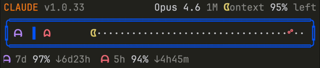
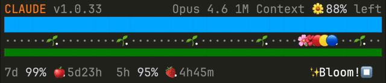

# Arcade Statusline for Claude Code


Turn your Claude Code status bar into a retro game. Two themes available: **Pac-Man inspired** (chase game) and **Pikmin Bloom inspired** (flower planting trail).

## Themes

### Pac-Man Inspired



Context window usage drives the character across the board, while rate limit ghosts chase from behind.

- **Chase game** -- Character position maps to context window usage; ghosts chase proportionally to rate limits
- **Ghost room** -- The 7-day ghost stays caged in a walled room when usage is under 50%, bouncing left and right
- **Chomp animation** -- Character toggles between open (ᗧ) and closed (●) mouth on each refresh
- **Ghost animation** -- Both ghosts alternate legs (ᗩ/ᗣ) in opposite phase
- **Cherry at 95%** -- A red cherry (ᐝ) marks the auto-compact threshold
- **Game over** -- When a rate limit hits 100%, the ghost catches the character and GAME OVER appears
- **Effort badge** -- Your `effortLevel` from `~/.claude/settings.json` appears after the 5-hour rate limit; hidden during GAME OVER

### Pikmin Bloom Inspired



A squad walks in place while a flower trail scrolls behind them. Using context plants flowers; idle time leaves footprints.

- **Flower planting** -- Every 15-minute slot gets a flower if you consumed context, or a dot (·) if idle
- **Big flower cycle** -- Every 8 slots (~2 hours), a big flower slot (🪻🌻🌷) appears with a seedling (🌱) waiting to bloom
- **Pikmin animation** -- 🔴🟡🔵 squad alternates order on each refresh
- **Fruit on reset** -- Rate limit reset times show as fruit (🍎🍊🍋🍇🍓🍑🫐) in future slots
- **Rate limit aware** -- Rate limit hit prevents flower planting for that slot
- **Effort badge** -- Your `effortLevel` from `~/.claude/settings.json` appears before the bloom indicator; `xhigh` / `max` add a ⏩ marker; hidden when a rate limit is hit

### Common

- **Color-coded warnings** -- Remaining percentages: white (safe) / yellow (caution) / red (critical)
- **Header info** -- Model name, context size, version, and remaining context percentage

## Install

### macOS / Linux

```sh
bash <(curl -fsSL https://raw.githubusercontent.com/sorosora/arcade-statusline/main/install.sh)
```

### Windows (PowerShell)

```powershell
irm https://raw.githubusercontent.com/sorosora/arcade-statusline/main/install.ps1 | iex
```

The installer will preview both themes and let you choose interactively. You can also skip the prompt with `--theme`:

```sh
# --theme pacman | pikmin
bash <(curl -fsSL https://raw.githubusercontent.com/sorosora/arcade-statusline/main/install.sh) --theme pikmin
```

To change theme later, run the installer again or edit `--theme` in `~/.claude/settings.json`.

### Manual Install

<details>
<summary>Download binary manually</summary>

```sh
mkdir -p ~/.claude && cd ~/.claude
# macOS (Apple Silicon)
curl -fsSL -L https://github.com/sorosora/arcade-statusline/releases/latest/download/arcade-statusline-aarch64-apple-darwin.tar.xz | tar xJ
# macOS (Intel)
curl -fsSL -L https://github.com/sorosora/arcade-statusline/releases/latest/download/arcade-statusline-x86_64-apple-darwin.tar.xz | tar xJ
# Linux (x86_64)
curl -fsSL -L https://github.com/sorosora/arcade-statusline/releases/latest/download/arcade-statusline-x86_64-unknown-linux-gnu.tar.xz | tar xJ

chmod +x arcade-statusline
```

Add to `~/.claude/settings.json`:

```json
{
  "statusLine": {
    "type": "command",
    "command": "~/.claude/arcade-statusline --theme pacman"
  }
}
```

</details>

### Options

| Flag | Description |
|---|---|
| `--theme <NAME>` | Theme: `pacman` (default), `pikmin` |
| `--width <N>` | Override statusline width (auto-detected from terminal) |
| `--narrow-emoji` | Force narrow emoji mode (auto-detected for JetBrains) |
| `--buddy-padding` | Add padding lines for Claude Code buddy alignment (JetBrains only) |

**JetBrains users:** JetBrains terminals render emoji as 1 column instead of 2 ([IJPL-106227](https://youtrack.jetbrains.com/issue/IJPL-106227)). The binary auto-detects this and compensates. If the Claude Code buddy overlaps with your statusline, add `--buddy-padding`:

```json
{
  "statusLine": {
    "type": "command",
    "command": "~/.claude/arcade-statusline --theme pikmin --buddy-padding"
  }
}
```

<details>
<summary>Build from source</summary>

```sh
git clone https://github.com/sorosora/arcade-statusline.git
cd arcade-statusline
cargo build --release
cp target/release/arcade-statusline ~/.claude/
```

</details>

## How It Works

Claude Code pipes JSON status data to the binary via stdin. The binary maps metrics to game elements and outputs ANSI-colored text.

### Pac-Man Inspired

| Metric | Game Element |
|---|---|
| Context window used % | Character position (left to right) |
| 5-hour rate limit % | Red ghost chasing |
| 7-day rate limit % | Purple ghost (caged when under 50%) |
| Rate limit hits 100% | Ghost catches character = GAME OVER |
| 95% context position | Cherry (ᐝ) = auto-compact warning |
| `effortLevel` from settings | Text after 5h rate limit |

### Pikmin Bloom Inspired

| Metric | Game Element |
|---|---|
| Context consumed in 15-min slot | Flower planted (🌸🌺🌼 or 🪻🌻🌷) |
| No context consumed | Dot (·) or seedling (🌱) |
| Rate limit reset time | Fruit in future slot |
| Rate limit hits 100% | Flower planting blocked |
| `effortLevel` from settings | Text before bloom indicator (`xhigh` / `max` add ⏩) |

All percentages displayed are **remaining** (not used), so you always know how much is left.

## Legacy Scripts (Deprecated)

> The standalone shell/PowerShell statusline scripts (`statusline.sh`, `statusline.ps1`) are deprecated. They remain in the repo for reference but are no longer maintained. Use the Rust binary instead.
>
> Requirements: jq (macOS/Linux), PowerShell 7+ (Windows).

## Uninstall

**macOS / Linux:**
```sh
rm ~/.claude/arcade-statusline
```

**Windows:**
```powershell
Remove-Item "$env:USERPROFILE\.claude\arcade-statusline.exe"
```

Then remove the `"statusLine"` key from `~/.claude/settings.json`.

## License

[MIT](LICENSE)
