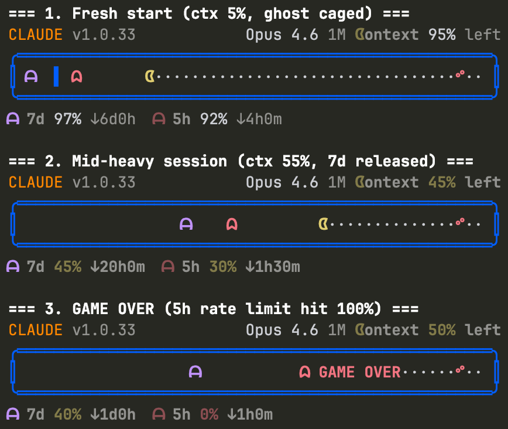

# Pac-Man Inspired Arcade Statusline for Claude Code

Turn your Claude Code status bar into a retro chase game. Context window usage drives Pac-Man across the board, while rate limit ghosts chase from behind.

## Preview



## Features

- **Chase game** -- Pac-Man position maps to context window usage; ghosts chase proportionally to rate limits
- **Ghost room** -- The 7-day ghost stays caged in a walled room when usage is under 50%, bouncing left and right
- **Chomp animation** -- Pac-Man toggles between open (ᗧ) and closed (●) mouth on each refresh
- **Ghost animation** -- Both ghosts alternate legs (ᗩ/ᗣ) in opposite phase
- **Cherry at 95%** -- A red cherry (ᐝ) marks the auto-compact threshold
- **Game over** -- When a rate limit hits 100%, the ghost catches Pac-Man and GAME OVER appears
- **Color-coded warnings** -- Remaining percentages: white (safe) / yellow (caution) / red (critical)
- **Header info** -- Model name, context size, version, and remaining context percentage

## Install

One command:

```sh
bash <(curl -fsSL https://raw.githubusercontent.com/sorosora/arcade-statusline/main/install.sh)
```

### Manual Install

1. Download the script:
   ```sh
   mkdir -p ~/.claude
   curl -fsSL https://raw.githubusercontent.com/sorosora/arcade-statusline/main/statusline.sh -o ~/.claude/statusline.sh
   chmod +x ~/.claude/statusline.sh
   ```

2. Add to `~/.claude/settings.json`:
   ```json
   {
     "statusLine": {
       "type": "command",
       "command": "bash ~/.claude/statusline.sh"
     }
   }
   ```

## Requirements

- **bash** (4.0+)
- **jq** -- for JSON parsing (`brew install jq` / `apt install jq`)

## How It Works

Claude Code pipes JSON status data to the script via stdin. The script maps metrics to game elements:

| Metric | Game Element |
|---|---|
| Context window used % | Pac-Man position (left to right) |
| 5-hour rate limit % | Red ghost chasing Pac-Man |
| 7-day rate limit % | Purple ghost (caged when under 50%) |
| Rate limit hits 100% | Ghost catches Pac-Man = GAME OVER |
| 95% context position | Cherry (ᐝ) = auto-compact warning |
| Each refresh | Pac-Man chomps + ghosts animate |

All percentages displayed are **remaining** (not used), so you always know how much is left.

## Uninstall

```sh
rm ~/.claude/statusline.sh
```

Then remove the `"statusLine"` key from `~/.claude/settings.json`.

## License

[MIT](LICENSE)
